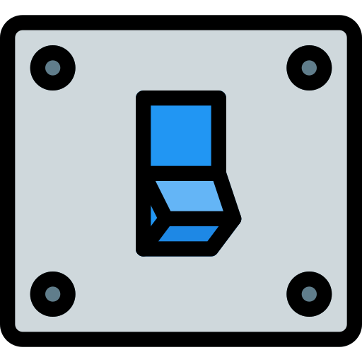

  
  <h1 align="center">TrigPLC</h1>
  
TrigPLC allows to <b>integrate</b> a Controllino device with Home Assistant using MQTT.

  

    
    
    
  

# Features

This repo is my Controllino firmware for home automation

Current feature:

- [x] Home assistant integration with auto discovery
- [x] FreeRTOS integration
- [ ] Multiple press (eg. double press --> 2 lights)
- [ ] OTA update 

# Brief introduction

TrigPLC is an open source firmware for the Controllino, an industry-grade PLC Arduino compatible. The firmware should be working with an Arduino Mega 2560 and a w5100 shield for ethernet connection.

Check [Controllino webpage](https://www.controllino.com/) if you are interested.

# Why FreeRTOS

I do like task management based on FreeRTOS, thus I have created two independent task with different priority:

- Hight priority: Task that manage the basic functionality ( button pressed --> light on)
- Low priority: Task that manage the IoT functionality

For further information about freertos library please check [FreeRTOS website](https://www.freertos.org/)

# Notes

If you intend to modify the FreeRTOS tasks make sure to adjust properly the stack size for each task.

Icons made by <a href="https://www.flaticon.com/authors/pixel-perfect" title="Pixel perfect">Pixel perfect</a> from <a href="https://www.flaticon.com/" title="Flaticon">www.flaticon.com</a>

